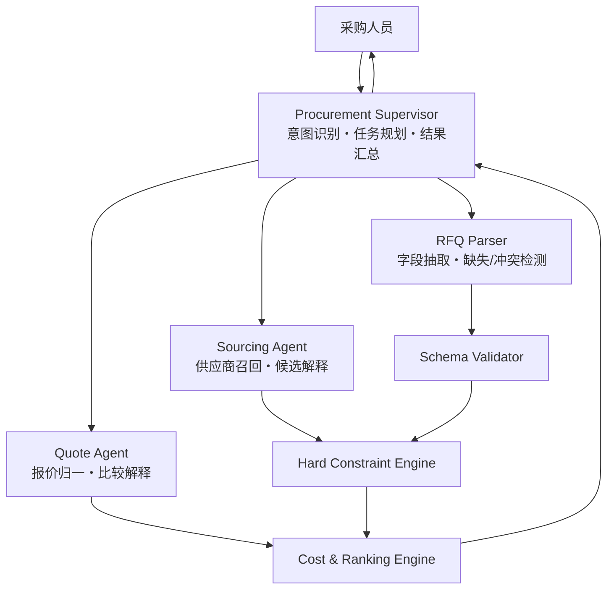
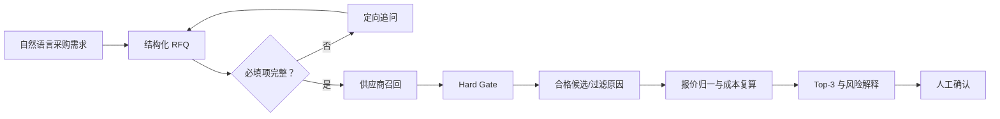

# 寻策 SourcePilot

> AI Sourcing & Supplier Decision Copilot｜跨境 AI 寻源与供应商决策助手

SourcePilot 面向中小跨境电商与贸易团队，将自然语言采购需求转化为结构化 RFQ，完成供应商召回、硬约束过滤、报价标准化与可解释排序，帮助采购人员更快形成**可比较、可追溯、可人工复核**的供应商 Shortlist。

本仓库为 **Portfolio Edition**：仅包含可公开展示的源码、合成示例数据、离线评测与必要文档，不含真实供应商信息、用户数据、密钥、数据库、缓存或运行日志。

## 为什么做 SourcePilot

跨境采购的主要问题通常不是“找不到供应商”，而是：

- 需求散落在聊天、邮件和表格中，数量、价格、认证、交期容易缺失或冲突；
- 供应商字段口径不同，MOQ、定制能力和认证难以横向比较；
- 报价包含 Logo 费、包装费、固定费和不同贸易术语，人工归一耗时；
- 纯 LLM 推荐难以保证硬约束，传统规则又难以理解自然语言；
- 最终决策缺少证据链，团队难以复盘“为什么选它”。

SourcePilot 用 **Agent 负责理解与协作，确定性代码负责业务裁决，采购人员负责最终审批**。

## 产品边界

### 当前 MVP 包含

- RFQ 字段抽取、缺失项识别与冲突检测；
- 供应商召回、硬约束过滤与固定原因码；
- 报价抽取、标准化与 Effective Unit Cost 复算；
- Qualified Shortlist、Top-3 排序、优势与风险解释；
- 企业采购偏好记忆、会话持久化和事件流；
- 循环检测、顺序检查、输出护栏、熔断与降级；
- 合成离线评测集和可复现评测脚本。

### 当前 MVP 不包含

- 不自动发送询价、不自动议价、不自动定标、签约、付款或下单；
- 不声称接入任何平台的全量实时供应商；
- 不将缺少运费、关税和税费的数据称为完整 Landed Cost；
- 不将合成离线指标描述为真实客户 ROI 或生产准确率；
- 关键外部动作始终需要人工确认。

## 1+2 Multi-Agent 架构

当前产品架构固定为一个总控 Agent 与两个专家 Agent：



- **Procurement Supervisor**：主会话、任务计划、路由、偏好注入与结果汇总；
- **Sourcing Agent**：RFQ 条件到供应商检索、硬过滤和候选解释；
- **Quote Agent**：报价字段抽取、成本归一与确定性比较；
- **RFQ Parser、Hard Constraint、Cost Calculator、Ranking、Decision Explanation** 是能力模块，不独立 Agent 化。

简单单步任务由主 Agent 直接调用工具；只有需要并行、上下文隔离或较深调用链时才派发专家 Agent，避免无意义的 Agent 调用成本和上下文污染。

## 核心工作流



Hard Gate 固定检查：MOQ、目标价格、认证、交期、定制能力。未通过的供应商不会因为模型解释而重新进入 Qualified Shortlist；关键字段未知时显式标记 `unknown`。

## 离线评测

以下结果来自仓库中的合成 `mvp_seed` 数据，仅用于工程与产品机制验证：

| 指标 | 结果 | 数据边界 |
|---|---:|---|
| RFQ Schema 合法率 | 100.0% | 50 条合成 RFQ case |
| RFQ 微观字段准确率 | 98.7% | 离线 regex 降级路径 |
| 关键约束召回率 | 96.3% | 显式约束标签 |
| 报价微观字段准确率 | 97.5% | 35 条混合格式报价 |
| 成本计算准确率 | 100.0% | 19 条字段完整成本 case |
| Supplier Recall@10 | 96.7% | keyword 降级路径 |
| Supplier Recall@20 | 100.0% | keyword 降级路径 |
| Hard Constraint 满足率 | 100.0% | 独立规则复核 |
| Top-3 成员一致率 | 90.0% | 10 条合成决策 case |
| 成对排序一致率 | 73.3% | 软排序仍需真实偏好校准 |

尚未测量真实用户 TTQS、生产 Token 成本、真实 ROI 与线上留存，仓库不会虚构这些数字。

复现评测：

```bash
uv run python scripts/eval_sourcing.py
```

## 快速开始

### 1. 环境要求

- Python 3.11–3.13
- Node.js 20+
- `uv`
- 一个 OpenAI-compatible Chat Completions API

### 2. 配置

```bash
cp .env.example .env
```

只在本地 `.env` 中填写密钥。`.env` 已被忽略，禁止提交到 GitHub。

### 3. 后端

```bash
uv sync --dev
uv run uvicorn app.presentation.server:app --host 0.0.0.0 --port 8000
```

### 4. 前端

```bash
cd frontend
npm ci
npm run dev
```

默认地址：前端 `http://localhost:5173`，后端 `http://localhost:8000`。

### 5. Docker Compose

```bash
export LLM_BASE_URL="https://your-provider.example/v1"
export LLM_API_KEY="your_api_key"
docker compose -f docker/docker-compose.yaml up --build
```

## 项目结构

```text
sourcepilot/
├── app/
│   ├── application/       # Supervisor、Sourcing/Quote Agent、工具与用例
│   ├── domain/            # RFQ、Supplier、Quotation 等领域对象
│   ├── infrastructure/    # LLM、检索、缓存、队列、持久化与安全护栏
│   └── presentation/      # FastAPI、WebSocket 与 DTO
├── frontend/              # React + TypeScript 演示前端
├── prototype/             # 可直接打开的单文件 HTML 产品原型
├── eval/                  # 合成评测集与离线结果
├── scripts/               # 评测、Smoke Test 与负载测试
├── tests/                 # 领域、工具、护栏、记忆与检索测试
├── docs/                  # 架构、产品边界、评测和安全说明
├── .github/workflows/     # GitHub Actions CI
├── .env.example           # 无真实密钥的配置模板
└── docker/                # 本地全栈编排
```

## 安全设计

- LLM 只负责语义理解与解释，Hard Gate、成本与评分由确定性代码执行；
- 输出护栏阻止无证据供应商事实和越权动作；
- Tool Middleware 提供调用顺序检查、循环检测、超时、重试与熔断；
- 采购偏好采用白名单类型，当前条件优先于历史记忆；
- 所有写操作与外部商业动作必须人工确认；
- 仓库只包含合成数据，不包含真实供应商或客户数据。

详见 [SECURITY.md](SECURITY.md) 与 [docs/security-and-data.md](docs/security-and-data.md)。

## 文档

- [产品边界](docs/product-scope.md)
- [独立立项产品叙事](docs/product-narrative.md)
- [MVP PRD](docs/PRD.md)
- [业务流程前后变化](docs/business-process.md)
- [系统架构](docs/architecture.md)
- [评测设计](docs/evaluation.md)
- [安全与数据说明](docs/security-and-data.md)
- [静态 UI 原型](prototype/sourcepilot-ui.html)

## 运行状态说明

- `LLM_API_KEY` 缺失时，在线 Agent 服务不会启动；离线 RFQ、报价、召回和决策评测仍可运行。
- Embedding、Reranker、Redis、Qdrant 服务均可选；不可用时按代码定义降级。
- `eval/` 中公司、报价和采购任务均为合成样例，不代表任何真实企业。

## License

本 Portfolio Edition 暂未附带开源许可证。在明确授权前，默认保留全部权利；如需公开协作，请先选择合适许可证。
