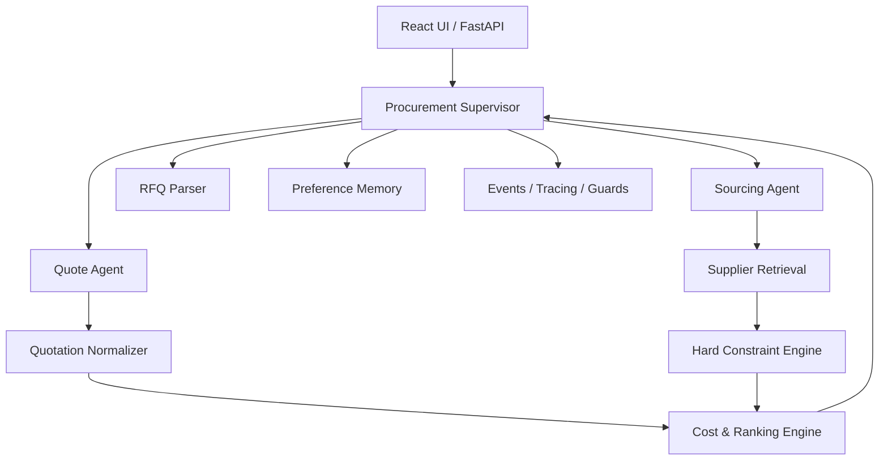

# 系统架构

## 架构原则

SourcePilot 采用 1+2 Multi-Agent 与确定性业务引擎的混合架构：

- Agent 负责语义理解、任务规划、并发协作和解释；
- Python 负责 Schema、Hard Constraint、成本复算和排序；
- 采购人员负责所有高风险外部动作。

## Agent 职责

| 单元 | 职责 | 禁止事项 |
|---|---|---|
| Procurement Supervisor | 意图识别、计划、路由、并行、偏好注入、汇总 | 编造事实、覆盖规则、绕过确认 |
| Sourcing Agent | 结构化检索条件、调用召回、解释 Qualified/Filtered | 将过滤候选重新推荐 |
| Quote Agent | 报价抽取、标准化、调用成本与比较工具 | 猜测未知字段、自动对外发送 |

RFQ Parser、Hard Constraint、Cost Calculator、Ranking 和 Decision Explanation 均为能力模块，不独立 Agent 化。

## 确定性边界

Hard Gate 检查：

- `supplier.moq <= rfq.quantity`
- `unit_price <= target_price`
- 必需认证可验证
- `lead_time_days <= max_lead_time_days`
- 所需定制能力可验证

未知字段显式标记，不默认通过。Soft Rank 仅作用于已经通过 Hard Gate 的候选。

## 上下文与并发

- 每个会话持有独立 Main Agent State；
- 专家 Agent 每次派发创建独立上下文，只回传最终结论；
- 多个独立品类或多份报价可并行；
- 简单单步任务直接调用工具，减少 Token、时延和上下文污染。
