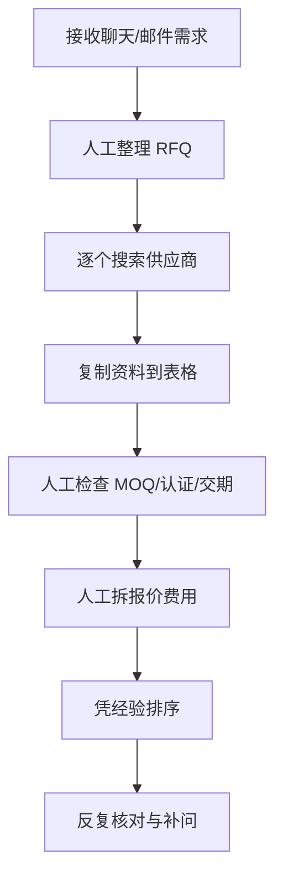
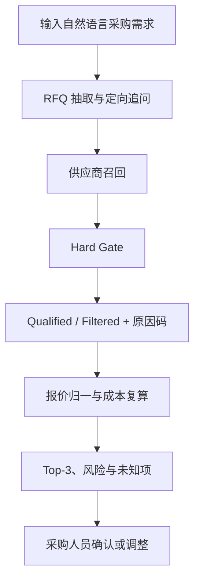

# 业务流程前后变化

这里的“前后”仅比较采购团队采用 SourcePilot 前后的工作方式。

## 采用前：人工串联信息

主要问题：字段容易遗漏、筛选口径不一致、报价计算难复核、候选进出缺少原因记录。

## 采用后：人机协同决策链

## 角色与产物变化

| 环节 | 采用前 | 采用后 | 人的责任 |
|---|---|---|---|
| 需求整理 | 手工抄录和补字段 | 自动抽取 RFQ、提示缺失与冲突 | 确认关键字段 |
| 供应商初筛 | 表格逐项判断 | Hard Gate 输出固定原因码 | 核验来源与 unknown |
| 报价比较 | 手算并统一格式 | 结构化报价与成本复算 | 确认费用口径 |
| 候选排序 | 依赖个人经验 | 合格集内固定权重排序 | 接受、调整或拒绝 |
| 过程复盘 | 聊天和表格难追溯 | 保留 RFQ、过滤、成本与事件证据 | 对最终决策负责 |

## 核心变化

- 从“先搜再补条件”变为“先确认 RFQ，再召回和过滤”；
- 从“模型直接推荐”变为“模型理解 + 确定性 Hard Gate”；
- 从“总价看起来更低”变为“统一费用口径后比较”；
- 从“只给结论”变为“候选、过滤原因、未知字段和风险共同呈现”；
- 从“追求自动完成”变为“缩短 TTQS，同时保留人工决策权”。
